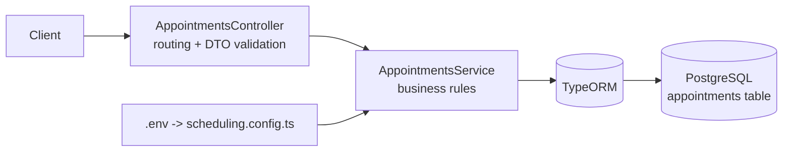
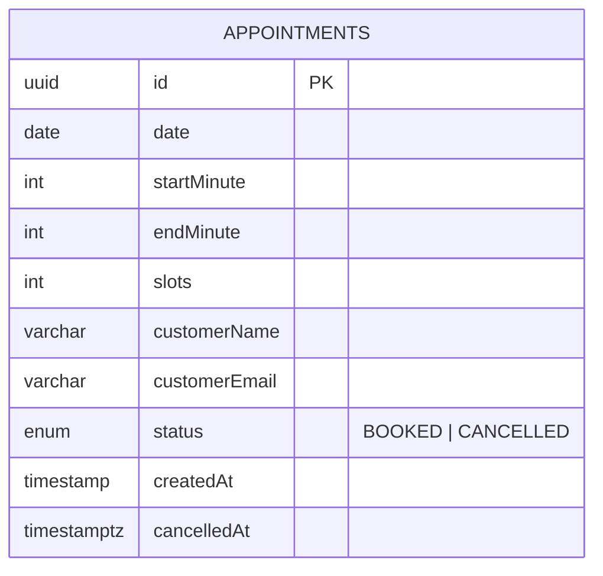
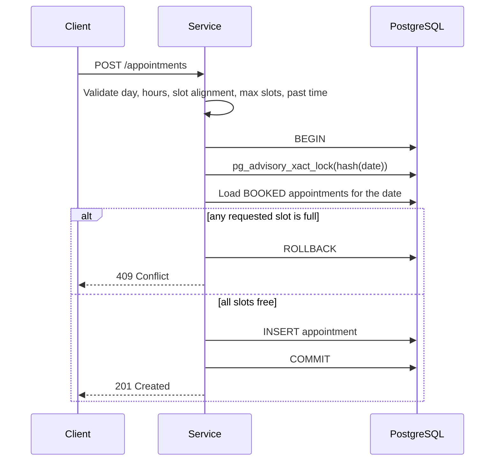
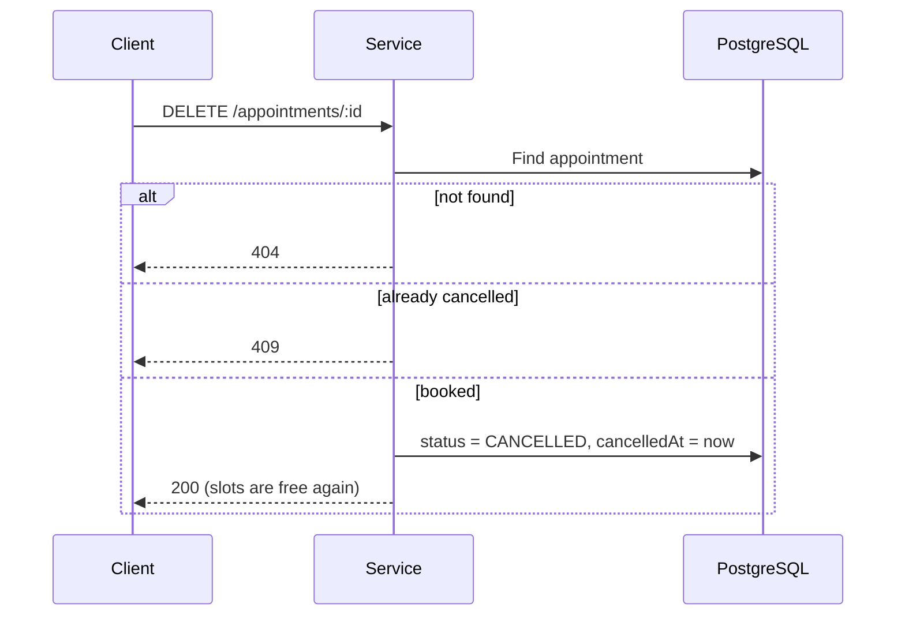

# Appointment Scheduling API

A simplified appointment scheduling REST API (similar in spirit to Calendly / Google Appointment Schedule), built with **NestJS**, **TypeScript**, **TypeORM** and **PostgreSQL**.

Customers can view available time slots for a date, book one or more consecutive slots, view their appointment, and cancel it. Slot length, working hours, working days and booking limits are all configurable through `.env`.

---

## Table of Contents

1. [Features](#features)
2. [Tech Stack](#tech-stack)
3. [Getting Started](#getting-started)
4. [Configuration](#configuration)
5. [API Reference](#api-reference)
6. [Business Rules](#business-rules)
7. [System Design](#system-design)
8. [Project Structure](#project-structure)
9. [Security](#security)
10. [Troubleshooting](#troubleshooting)
11. [Assumptions & Limitations](#assumptions--limitations)
12. [Possible Improvements](#possible-improvements)

---

## Features

- List available slots for a given date, with remaining capacity per slot
- Book an appointment covering 1 to 5 consecutive slots
- Availability is validated at booking time; remaining slots are reduced after a successful booking
- Cancel an appointment, which makes its slots available again
- Prevents double booking, including under concurrent requests
- Configurable slot duration (minimum 5 minutes), working hours, working days, max slots per appointment and capacity per slot
- Input validation, consistent HTTP status codes and clear error messages
- Swagger UI for interactive API docs

---

## Tech Stack

| Layer | Choice |
|---|---|
| Framework | NestJS 12 (`@nestjs/*` ^12) |
| Language | TypeScript 6 |
| Module system | ESM (`"type": "module"`) |
| ORM | TypeORM 1.x with `@nestjs/typeorm` 12 |
| Database | PostgreSQL 16 (`pg` ^8) |
| Validation | class-validator ^0.14 / class-transformer ^0.5 |
| API docs | `@nestjs/swagger` 12 + `swagger-ui-express` |
| Security headers | `helmet` (extra dependency, see [Getting Started](#getting-started)) |
| Testing | Vitest 4 + Supertest |
| Linting / formatting | oxlint, Prettier |

---

## Getting Started

### Prerequisites

- **Node.js 22.12+** (recommended). NestJS 12 and TypeORM 1.x need at least Node.js 20.19+ / 22.12+ at runtime, and the Nest CLI/schematics tooling requires 22.12+.
- Docker (for PostgreSQL), or your own PostgreSQL instance

### Setup

```bash
# 1. Install dependencies
npm install
npm install helmet          # used in main.ts; not part of the default Nest scaffold

# 2. Start PostgreSQL
docker compose up -d

# 3. Create your env file (adjust values if needed)
cp .env.example .env

# 4. Run the API in watch mode
npm run start:dev
```

- API base URL: `http://localhost:3000`
- Swagger UI: `http://localhost:3000/docs`

### Scripts

| Command | Description |
|---|---|
| `npm run start:dev` | Start with hot reload |
| `npm run start:debug` | Start with the debugger and hot reload |
| `npm run build` | Compile to `dist/` |
| `npm run start:prod` | Run the compiled build (`node dist/main`) |
| `npm run lint` | Lint with oxlint |
| `npm run format` | Format with Prettier |
| `npm test` | Run unit tests (Vitest) |
| `npm run test:cov` | Unit tests with coverage |
| `npm run test:e2e` | End-to-end tests (Vitest, `vitest.config.e2e.ts`) |

---

## Configuration

All settings live in `.env` (see `.env.example`).

### Server and database

| Variable | Default | Description |
|---|---|---|
| `PORT` | `3000` | HTTP port |
| `DB_HOST` | `localhost` | Postgres host |
| `DB_PORT` | `5432` | Postgres port |
| `DB_USER` | `postgres` | Postgres user |
| `DB_PASSWORD` | `postgres` | Postgres password |
| `DB_NAME` | `appointments` | Database name |
| `DB_SYNCHRONIZE` | `true` | Auto-create/update the table from the entity. **Development only**; use migrations in production |

### Scheduling

| Variable | Default | Rule |
|---|---|---|
| `SLOT_DURATION_MINUTES` | `30` | Integer, **minimum 5** |
| `MAX_SLOTS_PER_APPOINTMENT` | `5` | Integer, **1 to 5** |
| `OPERATING_START` | `09:00` | `HH:mm`, 24-hour |
| `OPERATING_END` | `18:00` | `HH:mm`, 24-hour; must fit at least one slot |
| `OPERATING_DAYS` | `1,2,3,4,5` | Comma list, `0`=Sunday ... `6`=Saturday (default Mon-Fri) |
| `SLOT_CAPACITY` | `1` | Number of bookings allowed per slot |

The scheduling values are validated when the app starts (`src/config/scheduling.config.ts`). If any value is invalid, the app refuses to start and tells you which variable is wrong.

---

## API Reference

| Method | Path | Description |
|---|---|---|
| `GET` | `/appointments/available-slots?date=YYYY-MM-DD` | Slots and remaining availability for a date |
| `POST` | `/appointments` | Book an appointment |
| `GET` | `/appointments/:id` | View one appointment |
| `DELETE` | `/appointments/:id` | Cancel an appointment |

### Get available slots

```bash
curl "http://localhost:3000/appointments/available-slots?date=2026-10-05"
```

```json
[
  { "date": "2026-10-05", "time": "09:00", "available_slots": 1 },
  { "date": "2026-10-05", "time": "09:30", "available_slots": 1 },
  { "date": "2026-10-05", "time": "10:00", "available_slots": 0 }
]
```

- `available_slots` = `SLOT_CAPACITY` minus the active bookings overlapping that slot.
- Slots that have already started (today) are returned with `available_slots: 0`.
- A non-working day (for example a Saturday) returns `[]`.

### Book an appointment

```bash
curl -X POST http://localhost:3000/appointments \
  -H "Content-Type: application/json" \
  -d '{
    "date": "2026-10-05",
    "time": "10:00",
    "slots": 2,
    "customerName": "Jane Doe",
    "customerEmail": "jane@example.com"
  }'
```

| Field | Type | Required | Notes |
|---|---|---|---|
| `date` | string | yes | `YYYY-MM-DD` |
| `time` | string | yes | `HH:mm`, must be the start of a slot |
| `slots` | integer | no | Default `1`; max is `MAX_SLOTS_PER_APPOINTMENT` |
| `customerName` | string | yes | Max 100 characters |
| `customerEmail` | string | yes | Valid email, max 255 characters |

Response `201 Created`:

```json
{
  "id": "5f0c1c9e-3a52-4d0e-9d0a-0b1f2a7d9c11",
  "date": "2026-10-05",
  "startMinute": 600,
  "endMinute": 660,
  "slots": 2,
  "customerName": "Jane Doe",
  "customerEmail": "jane@example.com",
  "status": "BOOKED",
  "createdAt": "2026-10-04T07:20:16.000Z",
  "cancelledAt": null
}
```

`startMinute` and `endMinute` are minutes since midnight (`600` = 10:00, `660` = 11:00; end is exclusive).

### Cancel an appointment

```bash
curl -X DELETE http://localhost:3000/appointments/5f0c1c9e-3a52-4d0e-9d0a-0b1f2a7d9c11
```

Returns `200` with the appointment where `status` is `CANCELLED` and `cancelledAt` is set. Its slots immediately appear as available again.

### Error responses

All errors use NestJS's standard shape:

```json
{ "statusCode": 409, "message": "Slot 10:00 on 2026-10-05 is no longer available", "error": "Conflict" }
```

| Status | When |
|---|---|
| `400 Bad Request` | Invalid or malformed input (bad date/time/email, unknown fields, invalid UUID); date is not a real calendar date; non-working day; time not aligned to the slot grid; appointment would end after closing time; `slots` above the configured max; slot is in the past |
| `404 Not Found` | Appointment ID does not exist |
| `409 Conflict` | A requested slot is already full; appointment is already cancelled |

---

## Business Rules

- Each slot is `SLOT_DURATION_MINUTES` long (default 30).
- Appointments are only available within `OPERATING_START` to `OPERATING_END` on `OPERATING_DAYS` (default 09:00 to 18:00, Mon-Fri).
- A booking's `time` must match a slot boundary. With defaults, `10:00` and `10:30` are valid, `10:15` is not.
- A booking of `n` slots occupies `n` consecutive slots and must finish by closing time. For example, with default hours the last 1-slot booking starts at 17:30.
- A slot cannot be booked more times than `SLOT_CAPACITY`.
- Past slots cannot be booked.
- Cancelled appointments no longer occupy any slot.

---

## System Design

### Architecture



- **Controller**: HTTP routing; request bodies and query strings are validated by DTOs.
- **Service**: all business rules (hours, days, slot alignment, capacity, past check, cancel).
- **Config**: `.env` values are parsed and validated once at startup, then injected into the service.

### Data model (single table)



Design decisions:

- **Slots are computed, not stored.** Availability is derived from the configured hours and the existing bookings. Changing the slot duration or working hours needs no data migration.
- **Time stored as minutes since midnight** (`startMinute`, `endMinute`). Existing bookings keep their real time range even if `SLOT_DURATION_MINUTES` changes later.
- **Soft cancel.** Cancelling sets `status = CANCELLED` instead of deleting the row. This keeps history and frees the slot, because availability only counts `BOOKED` rows.
- An index on `(date, status)` keeps the per-day lookup fast.

### How availability is calculated

For each slot `[s, s + duration)` on the requested date:

```
used      = number of BOOKED appointments where startMinute < s + duration AND endMinute > s
available = max(SLOT_CAPACITY - used, 0)
```

### Booking flow and double-booking protection



A plain "check, then insert" can race: two simultaneous requests can both see a free slot. To prevent this, each booking runs in a transaction that first takes a Postgres **advisory lock** keyed on the date. Concurrent bookings for the same date are handled one after another, so the second request sees the first one's booking and receives a `409`. Bookings for different dates do not block each other. The lock is released automatically when the transaction ends.

### Cancel flow



---

## Project Structure

```
src/
├── main.ts                          # Bootstrap: helmet, ValidationPipe, Swagger
├── app.module.ts                    # Root module: ConfigModule + TypeORM connection
├── config/
│   └── scheduling.config.ts         # Reads and validates scheduling settings from .env
└── appointments/
    ├── appointments.module.ts
    ├── appointments.controller.ts   # REST endpoints
    ├── appointments.service.ts      # Business logic
    ├── appointment.entity.ts        # TypeORM entity (the only table)
    └── dto/
        ├── create-appointment.dto.ts
        └── date-query.dto.ts
```

---

## Security

- **Input validation**: global `ValidationPipe` with `whitelist` and `forbidNonWhitelisted`, so unknown fields are rejected; format checks for date, time and email; length limits on strings.
- **UUID validation** on `:id` routes.
- **SQL injection**: all queries go through TypeORM, which uses parameterized statements.
- **Security headers** via `helmet` (install it separately: `npm install helmet`).
- **Fail-fast config**: invalid scheduling settings stop the app at startup.

Authentication and rate limiting are not included (see below).

---

## Troubleshooting

**`Nest can't resolve dependencies of the AppointmentsService (..., ?)` mentioning `ConfigService`**
`AppointmentsModule` cannot see `ConfigService`. Make sure `AppModule` imports `ConfigModule.forRoot({ isGlobal: true, load: [schedulingConfig] })`, and/or that `AppointmentsModule` imports `ConfigModule.forFeature(schedulingConfig)`. Also confirm `@nestjs/config` is installed.

**App exits at startup with a message such as `SLOT_DURATION_MINUTES must be >= 5`**
A scheduling value in `.env` is invalid. Fix the variable named in the message.

**`Cannot find module 'helmet'`**
Run `npm install helmet`, or remove the `helmet` import and `app.use(helmet())` line from `src/main.ts`.

**`Cannot find module './something'` (ESM)**
The project is ESM (`"type": "module"`). If your `tsconfig.json` uses `"module": "nodenext"`, relative imports need an explicit `.js` extension, for example `import { AppModule } from './app.module.js'`. Match whatever convention your generated files already use.

**Errors about unsupported Node.js version**
Upgrade to Node.js 22.12+ (20.19+ is the minimum for running the built app).

**Database connection errors**
Check that Postgres is running (`docker compose up -d`) and that the `DB_*` values in `.env` match it.

**Slots appear blocked at the wrong times**
The "past slot" check uses the server's local timezone. Start the app with the timezone you need, for example `TZ=Asia/Kuala_Lumpur npm run start:dev`.

---

## Assumptions & Limitations

- A single schedule (one calendar/resource). There is no multi-staff or multi-room support.
- Dates and times are interpreted in the server's timezone; the "past slot" check relies on it.
- `SLOT_CAPACITY` defaults to 1, matching the brief (one booking per slot).
- Changing `SLOT_DURATION_MINUTES` or working hours does not move existing bookings; they keep their stored time range.
- No authentication, so anyone with an appointment ID can view or cancel it.
- `DB_SYNCHRONIZE=true` is for development; use TypeORM migrations in production.

---

## Possible Improvements

- Authentication/authorization and per-user appointments
- Configurable timezone setting
- Reschedule endpoint
- Rate limiting (`@nestjs/throttler`) and request logging
- TypeORM migrations instead of `synchronize`
- Unit tests (Vitest) for slot calculation, and an end-to-end test that fires concurrent booking requests to prove double booking is impossible
- Email confirmation / reminders
- Dockerfile for the API itself
